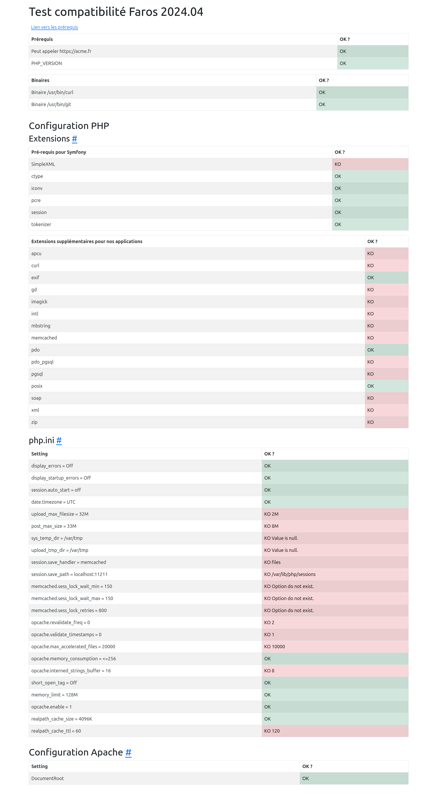
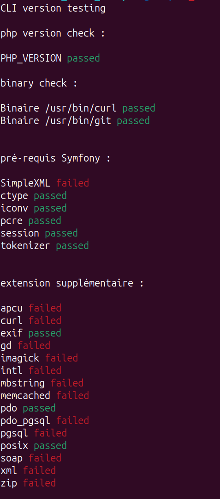
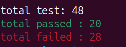

# Pré-requis hébergements

Ce site présente les configurations nécessaires à l’hébergement des projets réalisés au Phare.

## Installation

Prérequis : ruby, bundle, [jekyll](https://jekyllrb.com/docs/installation/)

- bundle config set --local path 'vendor/bundle'
- bundle install
- bundle exec jekyll serve

## Déploiement

Le déploiement est automatisé avec Github Pages.
