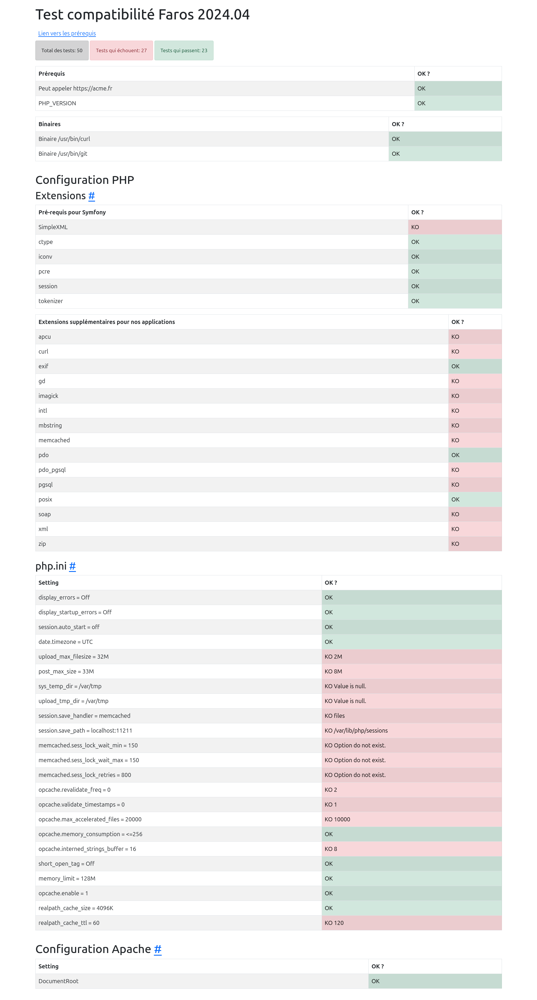
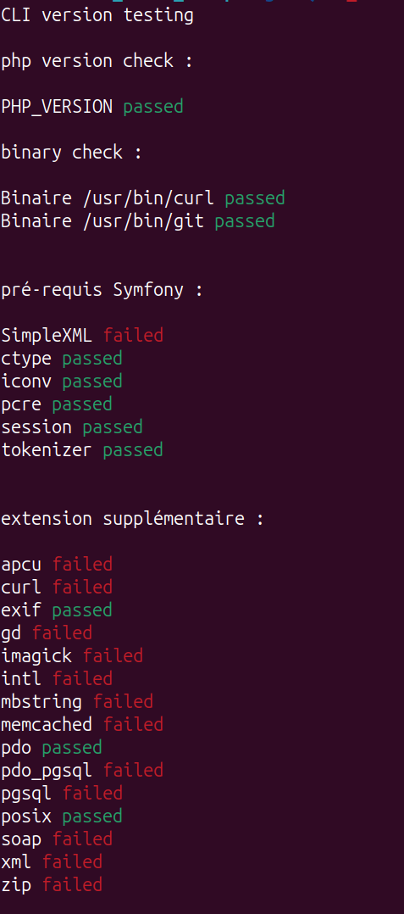
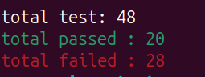

# Pré-requis hébergements

Ce site présente les configurations nécessaires à l’hébergement des projets réalisés au Phare.







## Utilisation

```shell
docker compose up -d
```

## Déploiement

Le déploiement est automatisé avec Github Pages.
